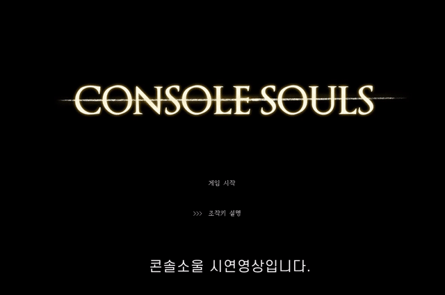
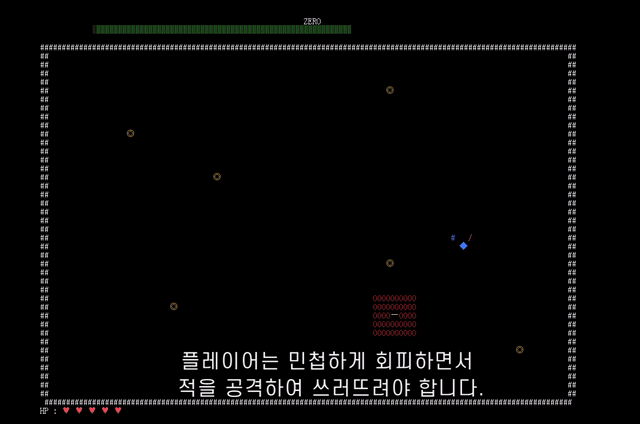

# ConsoleSouls

C 언어 콘솔 기반 액션 게임입니다.
다크소울에서 영감을 받아, 콘솔 창에서 특수문자만으로 게임을 구현했습니다.

**언어:** C
**개발 환경:** Windows, Win32 API

---

## 시연

---

## 구현 내용

### 게임 루프

초기화 → 무한 반복(입력 처리 → 업데이트 → 화면 출력) → 종료의 구조로 동작합니다.

### 렌더링

콘솔 창에 특수문자를 출력하고 지우는 방식으로 렌더링합니다.
`SetCurrentCursorPos`로 커서를 원하는 위치로 직접 이동시켜 출력하며,
이동 시 이전 위치의 문자를 지우고 새 좌표에 다시 출력합니다.

### 충돌 처리

맵과 같은 크기의 `gameGroundBack` 2D 배열을 유지합니다.
각 오브젝트에 고유 ID를 부여해 배열에 기록하고, 매 프레임마다 특정 ID가 감지되면 충돌로 처리합니다.

| ID | 오브젝트 |
|----|---------|
| 2 | 플레이어 |
| 6 | 덫 |
| 7 | 검 공격 |
| 8 | 보스 |
| 9 | 일반 공격 |

### 보스 AI 및 스킬

- 보스가 플레이어를 추격
- **덫 스킬**: 덫에 닿으면 무한 반복문으로 진입해 플레이어를 강제 정지시키고, 보스가 닿을 때까지 반복문 유지 후 해제
- **2페이즈**: HP가 일정 이하로 떨어지면 패턴 변화

### 기타

- 방향키/WASD 이동, J 공격, K 회피
- `clock_t`로 무적 시간, 공격 쿨타임 등 시간 기반 처리
- BGM 및 효과음 (winmm.lib)
