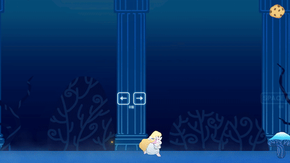
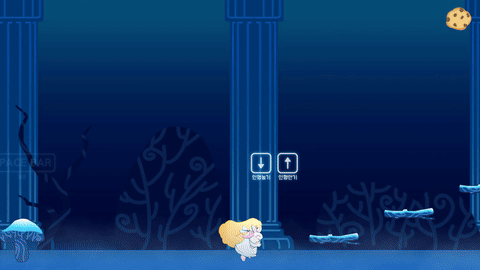
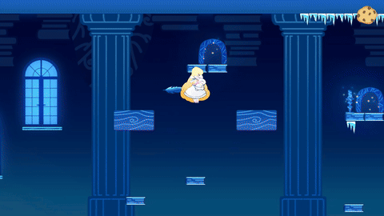

# Direct2D Team Project — Pocari

Direct2D 기반 2D 플랫포머 팀 프로젝트.
중력을 반전시키고 토끼 동료와 협력해 스테이지를 클리어하는 게임입니다.

**팀 구성:** 기획 2 / 개발 4 / 아트 2
**개발 기간:** 약 1개월
**기술 스택:** C++, Direct2D, Box2D

---

## 게임 플레이

---

## 담당 작업

### 1. PlayerComponent — 플레이어 캐릭터 컨트롤러

`Source/PlayerComponent.h` / `PlayerComponent.cpp`

**이동 및 물리**

- 좌우 이동, 점프, 빙판(SlideTile) 위에서의 미끄러움 처리
- 역중력 전환(R키): 콜라이더 오프셋 반전 후 RigidBody에 역중력 적용
- 착지 방향(위/아래)에 따라 애니메이션 이름 세트 전체를 교체해 일반/역중력 상태를 분리

**애니메이션 상태 관리**

- Idle → Walk → WalkToIdle 전환을 타이머로 제어
- 점프 초반/낙하 구간을 `m_jumpTime`으로 분기해 도약·낙하 애니메이션 구분
- 얼음 상태(Freeze)일 때 전용 애니메이션 세트로 자동 전환
- 키를 뗀 후 짧은 시간 달리기 상태 유지로 애니메이션 끊김 방지

**토끼 전환**

- 아래키 입력 시 인벤토리를 토끼에게 전달하고 카메라 타겟 변경
- 전환 중에는 빈손 애니메이션 재생, RigidBody 고정

**피격 처리**

- 고드름(Icicle) 트리거 진입 시 얼음 상태 + HP 감소 + 중력 반전
- HP 0이면 현재 씬 재시작

---

### 2. RabbitComponent — 토끼 캐릭터 컨트롤러

`Source/RabbitComponent.h` / `RabbitComponent.cpp`

**조작 및 이동**

- 플레이어와 독립적인 이동/점프 처리
- 비활성 상태에서는 플레이어 옆(±40px)에 붙어 따라다님

**강제 복귀 시스템**

- 토끼가 카메라 범위(가로 910px, 세로 410px)를 벗어나면 자동 복귀
- 위키 입력 시에도 복귀 예약
- 복귀 시 포인트 라이트 밝기를 서서히 올리는 이펙트 재생 후 `ReturnToPlayer` 호출
- 복귀 완료 후 라이트를 서서히 소멸

**플레이어 상태 동기화**

- 매 프레임 플레이어의 역중력 상태, 중력 전환 여부를 읽어 동기화
- 콜라이더 오프셋과 RigidBody 역중력을 플레이어와 동일하게 유지
