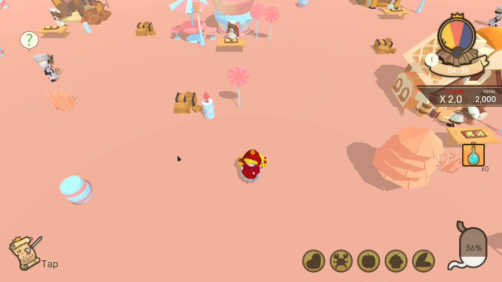
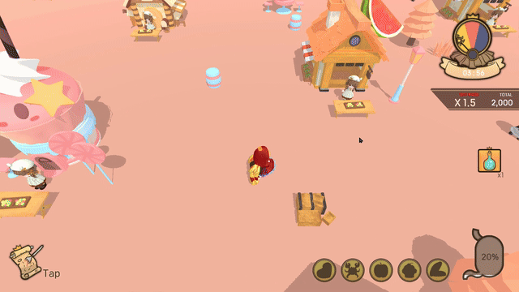

# Team Project — Paradise Bird

DirectX 11 기반 팀 프로젝트 게임.
적에게 들키지 않고 도망다니며 미션을 수행하는 게임으로, 미니게임 요소가 포함되어 있습니다.

**팀 구성:** 기획 3 / 개발 6 / 아트 3

**개발 기간:** 약 1개월

**기술 스택:** C++, DirectX 11, HLSL, Assimp, PhysX

---

## 게임 플레이

---

## 담당 작업

### 1. Shadow Map (그림자)

Deferred Rendering 파이프라인에 통합된 그림자 시스템을 구현했습니다.
정적 메시와 스키닝된 캐릭터 메시를 모두 지원합니다.

**구현 방식**

광원 시점의 뷰/프로젝션 행렬로 씬을 렌더링해 뎁스맵을 생성하고,
이후 패스에서 픽셀이 그림자 안에 있는지 비교해 그림자를 적용합니다.

**스키닝 지원**

캐릭터처럼 본 애니메이션이 있는 메시는 별도의 버텍스 셰이더(`DeferredShadowDepthVS.hlsl`)를 사용합니다.
최대 128개의 본 팔레트를 상수 버퍼로 전달받아 버텍스 셰이더에서 스키닝 연산 후 뎁스맵에 기록합니다.
정적 메시는 `DeferredShadowStaticVS.hlsl`로 분리해 불필요한 본 연산을 제거했습니다.

| 파일 | 설명 |
|------|------|
| `Shadow/ShadowMap.h` / `.cpp` | 뎁스맵 텍스처 생성, DSV/SRV 바인딩, 라이트 뷰·프로젝션 행렬 관리 |
| `Shadow/DeferredShadowDepthPS.hlsl` | 뎁스값을 컬러로 출력하는 픽셀 셰이더 |
| `Shadow/DeferredShadowDepthVS.hlsl` | 본 팔레트 기반 스키닝 버텍스 셰이더 |
| `Shadow/DeferredShadowStaticVS.hlsl` | 정적 메시용 버텍스 셰이더 |

---

### 2. UI 컴포넌트

게임에서 플레이어 상태를 표시하는 UI 컴포넌트들을 구현했습니다.
엔진의 컴포넌트 시스템 위에서 `UIRenderer`, `MeshFilter`를 조합해 동작합니다.

| 파일 | 설명 |
|------|------|
| `UI/UIGauge` | 플레이어 조준 게이지 바 |
| `UI/UIHungry` | 배고픔 수치 — 시간이 지날수록 감소하며 TextRender로 수치 표시 |
| `UI/UISkill` | 하단 스킬 슬롯 UI |
| `UI/UIMinimap` / `UIMiniMapIcon` | 미니맵 배경 및 오브젝트 아이콘 |
| `UI/ScoreUI` | 플레이어에 자식으로 붙어 따라다니는 점수 표시 UI |
